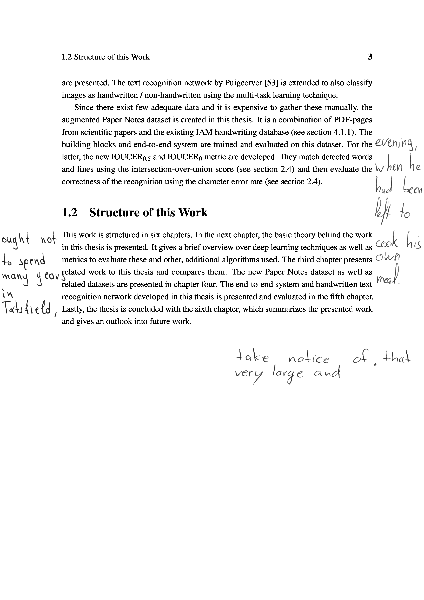

# Paper Notes

This dataset was developed for the master's thesis "End-to-End Recognition of Handwritten Notes in Scanned Documents" by Torben Meyer in 2018/2019.

It creates a mix of printed and handwritten pages by combining PDF's with data from the [IAM database](http://www.fki.inf.unibe.ch/databases/iam-handwriting-database).

As I do not own the rights to the PDFs (which are stemming from scientific papers), I cannot share them in here aswell.
However, using the following steps, you can generate "your own".



## Generation

You will need the following tools:

- Python 3.7 (install the dependencies in requirements.txt)
- ImageMagick's [convert](https://imagemagick.org/script/convert.php) tool

### 1. Gather Data

In the first step you need to get some data.
For this, place a couple of PDFs into `./data/paper/pdf/`. Ideally, they are also scientific research papers.
Secondly, you should download the [IAM database](http://www.fki.inf.unibe.ch/databases/iam-handwriting-database).
Make sure you have credentials (see their website) and run the following script:

```
bash ./1-download-iam.sh USERNAME PASSWORD
```

Make sure you replace `USERNAME` and `PASSWORD` accordingly.

### 2. Transform PDFs to PNGs

Next, you need to transfrom the PDFs into PNGs. For this, make sure you have _convert_ installed and then run

```
bash ./2-convert-pdfs.sh
```

> Unfortunately, this does not work perfectly. Sometimes, large chunks of the pages are not correctly converted. Make sure to filter these files out. They are typically very easy to detect by containing big black boxes.

### 3. Augment the _Paper Notes_ pages

Now you can augment your own Paper Notes pages.
This step also automatically splits the dataset into training, development, and testing subsets.
Simply run:

```
python -m lib.generate
```

Your _Paper Notes_ are now in the folder `./data/final/[dev/test/train]`.
There are three files created:

1. `*-paper.png`. This is the actually augmented file
2. `*-stripped.png`. This is a handwriting-only file ("stripped" of the printed part)
3. `*-truth.json`. This file contains the ground-truth regard the handwrittten words

Furthermore, there are `train.json`, `dev.json`, and `test.json` in the main folder. This folder lists which IAM lines were used in which subset.

### 4. Extract words

As text recognition systems should be trained to samples that are as life-like as possible (even though we just augmented them), we should extract a couple of single words from the files so we can train it on them.
Just run:

```
python -m lib.extract_words
```

In the folder `./data/words` you'll then find three different sets (also split into test/train/dev each):

- `*` (no prefix): This folder contains handwritten words as they appear in the Paper Notes (e.g. partially mixed with printed text)
- `pure_*`: This folder contains handwritten words only
- `print_*`: This contains words (or word-like images) free of handwriting. This can e.g. be printed words from the pages.

> _Be aware that extracting the printed words is very time consuming!_ This is for two reasons: First, the detection algorithm takes some time and second, there is a lot of printed words that can be detected. You may want to cancel it after you have gathered enough files.

### 5. Look at some stats

If you are curious to what your data looks like, you can run

```
python -m lib.stats
```

to find out a bit about them :)
